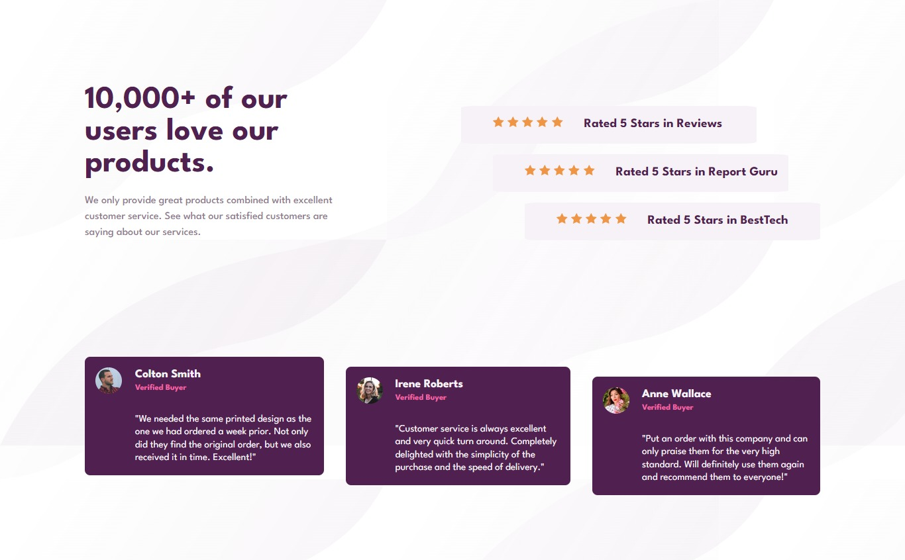
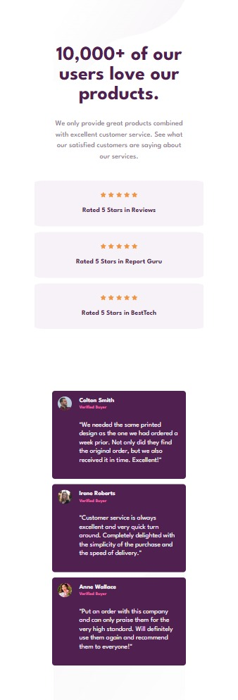

# Frontend Mentor - Stats preview card component solution

This is a solution to the [Stats preview card component challenge on Frontend Mentor](https://www.frontendmentor.io/challenges/stats-preview-card-component-8JqbgoU62). Frontend Mentor challenges help you improve your coding skills by building realistic projects. 

## Table of contents

  - [Overview](#overview)
  - [The challenge](#the-challenge)
  - [Screenshot](#screenshot)
  - [Links](#links)
  - [Built with](#built-with)
  - [Continued development](#continued-development)
  - [Useful Resources](#useful-resources)
  - [Author](#author)

## Overview

### The challenge

Users should be able to:

- View the optimal layout depending on their device's screen size

### Screenshot
Desktop Version

Mobile Version

### Links

- Solution URL: [Code on GitHub](https://github.com/Ninuolafs/Social-Proof-Section)
- Live Site URL: [Live Site](https://ninuolafs.github.io/Social-Proof-Section/)

### Built with

- Semantic HTML5 markup
- CSS custom properties
- Flexbox
- CSS Grid
- Desktop-first workflow

### Continued development

Going forward, I will keep doing more practice projects to get better acquainted with the in and out of HTML and CSS

### Useful resources

- [Build A Social Proof Section Using TailwindCSS - Frontend Mentor Challenge](https://www.youtube.com/watch?v=9ROfWv981gg&t=1814s) - This helped me understand the CSS grid and mobile layout for the project. I really liked this pattern and will use it going forward. I definitely recommend.

## Author

- Website - [Ninuola Femi-Sanni](https://ninuolafs.github.io/Personal-Site/)
- Frontend Mentor - [@Ninuolafs](https://www.frontendmentor.io/profile/Ninuolafs)
- Twitter - [@ninuola_fs](https://twitter.com/ninuola_fs)
